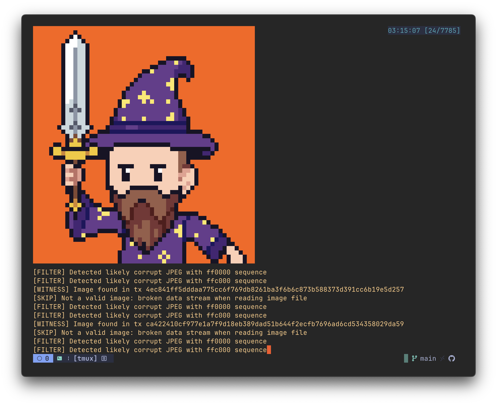

## Example: On-Chain Wizard Image

Here's an example of a real image found on Bitcoin using this tool:



You can discover images like this and more using the search and scan commands below!

# Bitcoin Meme Miner 🧙‍♂️🐒📸

**A Totally Serious Tool to Prove Bitcoin Censorship is a Pipe Dream!**

Bitcoin Meme Miner is a Python script that dives deep into the Bitcoin blockchain and mempool, hunting for images stuffed into transactions. Why? To hilariously expose the utter hopelessness of trying to filter out "naughty" data like memes, pixel art, or whatever else people sneak onto Bitcoin. Built during the _OP_RETURN wars_, this tool is here to troll the "censor Bitcoin" crowd by showing that you can’t stop the signal. It’s a chaotic mix of tech and memes—because why not?

## Features

- **Real-time Meme Hunting**: Scans the mempool and blockchain for images, because who doesn’t love a surprise JPEG?
- **Terminal Art Show**: Displays found images using `viu`—your terminal just became an art gallery!
- **Meme Hoarding**: Saves images to `images/` with metadata, so you can flex your collection.
- **Transaction Tattletale**: Indexes every image it finds in `images/index.json` for your viewing pleasure.
- **Jackpot Extraction Methods**:
  - **Ordinal Inscriptions**: Grabs those fancy Taproot-based NFTs (yes, monkey JPEGs included 🐒).
  - **OP_RETURN Outputs**: Snags tiny image chunks from OP_RETURN—because 80 bytes is enough for a pixel, right?
  - **Taproot Annex**: Digs into Taproot’s annex field for hidden gems (like that wizard JPEG 🧙‍♂️).
  - **Corrupted Outputs**: Finds images in sketchy, non-standard scripts—because rules are for suckers.
  - **Legacy/Segwit v0**: Old-school image embeds, because history matters.
- **Multiple Image Formats**: Supports PNG, JPEG, GIF, BMP, and **WEBP**—because variety is the spice of trolling.
- **Persistent Chaos**: Resumes scanning from the last block, so you never miss a meme.
- **Analysis Shenanigans**: Stats and search tools to rub it in—look at all these unstoppable images!
- **Enhanced Validation**: Performs rigorous image validation to detect corrupt data streams and invalid formats, but now with more permissive defaults to allow more good images through.
- **Automatic Repair**: Attempts to fix corrupted images by transcoding and repairing broken data structures.
- **Thumbnail Generation**: Creates thumbnails for all found images, making browsing the collection easier.
- **Detects Huffman Code Errors**: Advanced detection of common JPEG corruption patterns to prevent invalid display.

## Why Does This Exist?

Bitcoin Meme Miner was created as a _total joke_ to mess with people who think you can censor Bitcoin. Newsflash: you can’t! The OP_RETURN wars (2014–2025 and counting) are a clown show of folks trying to stop data like images from being embedded on-chain. Spoiler: Bitcoin doesn’t care about your feelings. This tool proves it by finding every pixelated treasure hidden in transactions, from Ordinal NFTs to tiny OP_RETURN doodles. Use it to laugh at the idea of blockchain censorship—or just to collect some dank memes.

## Requirements

- A full Bitcoin Core node with RPC access (you’re not a pleb, right?).
- Python 3.8+ and some packages (see below).
- `viu` for terminal art flexing (because screenshots are for normies).

## Setup

1. **Set Up Your Bitcoin Node Credentials:**
   Create a `.env` file with your Bitcoin Core RPC details. Don’t mess this up, or you’ll be mining memes in the void.

   ```
   BITCOIN_RPC_USER=yourusername
   BITCOIN_RPC_PASSWORD=yourpassword
   BITCOIN_RPC_HOST=127.0.0.1
   BITCOIN_RPC_PORT=8332
   ```

2. **Install Dependencies:**
   Grab the required Python packages. We’re not savages.

   ```bash
   pip install -r requirements.txt
   ```

   (`requirements.txt` includes `python-bitcoinlib`, `python-dotenv`—no IPFS nonsense here.)

3. **No IPFS, Because We’re On-Chain Gangsters:**

   - This tool only cares about images _directly_ on the Bitcoin blockchain.
   - IPFS support? Nah, that’s for off-chain cowards. We’re here for the real chaos.

4. **Install `viu` for Terminal Art:**
   Show off your finds in style.

   ```bash
   # macOS
   brew install viu

   # Linux
   cargo install viu
   ```

## Usage

### **Configure the Meme Miner**

Customize how strict the miner is about what images it extracts and validates:

```bash
# Show current configuration
python config.py --show

# Increase minimum image size to 1000 bytes (filters out tiny fragments)
python config.py --min-size=1000

# Enable strict validation (rejects corrupted images)
python config.py --strict-validation

# Skip displaying images in the terminal (faster processing)
python config.py --skip-display

# Only allow specific formats
python config.py --formats=png,jpeg

# Reset to default configuration
python config.py --reset
```

### **Advanced Configuration Options**

In addition to using `config.py`, you can set environment variables in your `.env` file:

```bash
# Enhanced validation for more accurate image detection
ENHANCED_VALIDATION=1

# Auto-repair corrupted images when found
AUTO_REPAIR_IMAGES=1

# Automatically generate thumbnails for all images
AUTO_THUMBNAILS=1

# Force saving invalid images for research (0 to discard)
FORCE_SAVE_INVALID=1
```

### **Start the Meme Hunt (Real-Time Monitoring)**

Unleash the chaos and watch Bitcoin Meme Miner find images in the mempool and new blocks.

```bash
python monitor_images.py
```

- Images pop up in your terminal via `viu`.
- They’re saved to `images/` with metadata in `images/index.json`.
- Laugh at the haters while sipping your coffee.

### **Snoop on a Specific Transaction**

Got a hot tip on a transaction with a spicy image? Look it up.

```bash
python lookup_image.py <txid>
```

Force a rescan if you’re feeling extra nosy:

```bash
python lookup_image.py <txid> --scan
```

### **Batch Scan for Hidden Treasures**

Scan a range of blocks for buried memes.

```bash
python batch_scan.py <start_block> <end_block> [--skip-blocks=N]
```

Examples:

```bash
# Scan blocks 890000-890100 for memes
python batch_scan.py 890000 890100

# Speed-scan every 10th block from 800000-900000
python batch_scan.py 800000 900000 --skip-blocks=10
```

### **Test the Meme Detectors**

Make sure all extraction methods are working. Don’t skip this—unless you like broken dreams.

```bash
python test_extraction.py
```

### **Meme Stats for Bragging Rights**

Generate stats to flex how many unstoppable images you’ve found.

```bash
python stats.py
```

Fancy formats:

```bash
# JSON for nerds
python stats.py --output=json

# CSV for spreadsheet warriors
python stats.py --output=csv
```

### **Search for the Juiciest Memes**

Hunt for specific images like a blockchain detective.

```bash
python search_images.py [--type=FORMAT] [--method=METHOD] [--block-range=MIN-MAX] [--limit=N] [--display]
```

Examples:

```bash
# Find 5 PNGs and show them off
python search_images.py --type=png --limit=5 --display

# Hunt for Ordinal inscriptions in blocks 800000-810000
python search_images.py --method=ordinal --block-range=800000-810000

# Dig up corrupted output memes
python search_images.py --method=corrupted_output --limit=3
```

### **Repair Corrupted Images**

Fix corrupted images in your collection with the repair tool:

```bash
python repair_images.py
```

Options:

```bash
# Specify a different directory
python repair_images.py --dir=/path/to/images

# Skip thumbnail generation
python repair_images.py --skip-thumbnails
```

### **Generate Thumbnails**

Create thumbnails for all your images to make browsing easier:

```bash
python thumbnail_generator.py
```

Options:

```bash
# Specify a different directory
python thumbnail_generator.py --dir=/path/to/images

# Skip updating index.json
python thumbnail_generator.py --no-index-update
```

### **Extraction Methods (a.k.a. Meme Mining Techniques)**

Bitcoin Meme Miner uses every trick in the book to find images:

1. **Ordinal Inscriptions**: Taproot-based NFTs—think pixelated monkeys and wizards.
2. **OP_RETURN Outputs**: Tiny 80-byte image chunks, because why not?
3. **Taproot Annex**: Hidden gems in Taproot’s annex field (like that wizard JPEG 🧙‍♂️).
4. **Corrupted Outputs**: Sketchy scripts with image data, because rules are dumb.
5. **Legacy/Segwit v0**: Old-school embeds for the history buffs.

## Bitcoin Node Setup

You’ll need a full Bitcoin Core node with RPC access to mine these memes. Don’t have one? Use my [bitcoin-lima](https://github.com/nipiQ/bitcoin-lima) repo to spin up a node in a Lima VM faster than you can say “censorship is futile.”

## Disclaimer

This tool is a _joke_—but a functional one! It’s here to troll people who think they can censor Bitcoin by showing how easy it is to find images on-chain. Use it for fun, memes, and maybe some light chaos. Don’t take it too seriously, but do enjoy the pixelated ride.

---

## 🧙‍♂️ Bitcoin Donation

Bitcoin Layer 2 and wizard JPEGs on the blockchain got your sats in a tizzy? Fear not, brave crypto anti-wizard! Fling some Bitcoin my way to soothe your soul!

<p align="center">
  
</p>

<p align="center">
  <code>bc1qxtax3zukv4depk8dy8qxacr3pqptgva6699fnz</code>
</p>

<p align="center">
  <em>Copy this address and zap some sats to fuel my wizardry! 🪄</em>
</p>
